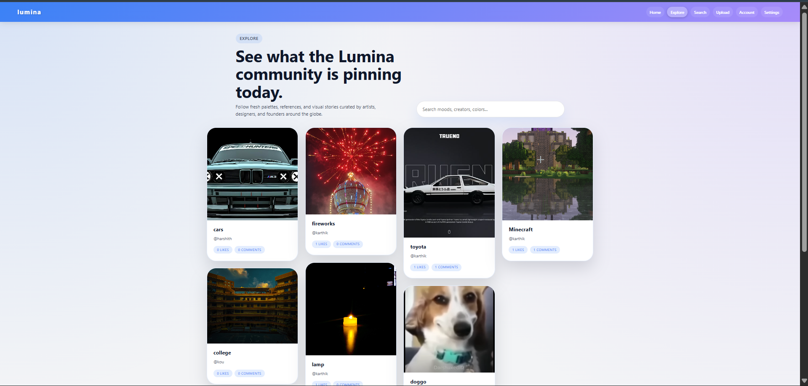

# Lumina
Lumina is a full-stack web application that allows users to create, share, and discover posts.
It includes a **Node.js + Express backend** and a **modern frontend application**.
---
##Features
* User authentication (JWT based)
* Create, edit, and delete posts
* Search functionality
* File uploads
* REST API backend
* Modern frontend interface
* 
##  Tech Stack
### Frontend
* JavaScript
* HTML / CSS
* Modern frontend framework (React / Vite if applicable)
### Backend
* Node.js
* Express.js
* MongoDB
* JWT Authentication
* Multer (file uploads)

## 📂 Project Structure
lumina
│
├── backend
│   ├── middleware
│   ├── models
│   ├── routes
│   ├── utils
│   └── server.js
│
└── frontend
    ├── src
    ├── public
    └── package.json

## ⚙️ Installation

### 1️⃣ Clone the repository
git clone https://github.com/Karthik-R-Nayak/lumina.git

### 2️⃣ Navigate into the project

cd lumina

## 🔧 Backend Setup

cd backend
npm install
Create a `.env` file and add:

PORT=5000
MONGO_URI=your_mongodb_connection_string
JWT_SECRET=your_secret_key

Start the backend server:
npm start

## 💻 Frontend Setup
cd frontend
npm install
npm run dev

## 🌐 API Routes

| Method | Route       | Description         |
| ------ | ----------- | ------------------- |
| POST   | /api/auth   | User authentication |
| GET    | /api/posts  | Get all posts       |
| POST   | /api/posts  | Create post         |
| GET    | /api/search | Search posts        |

## 📸 Screenshots

 screenshots of app 

## 👨‍💻 Author

**Karthik R Nayak**

GitHub:
https://github.com/Karthik-R-Nayak
